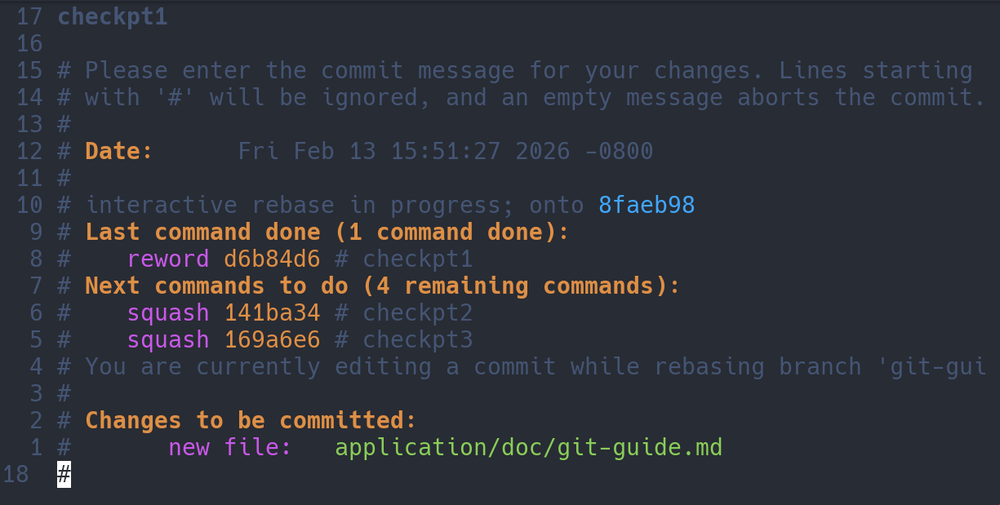
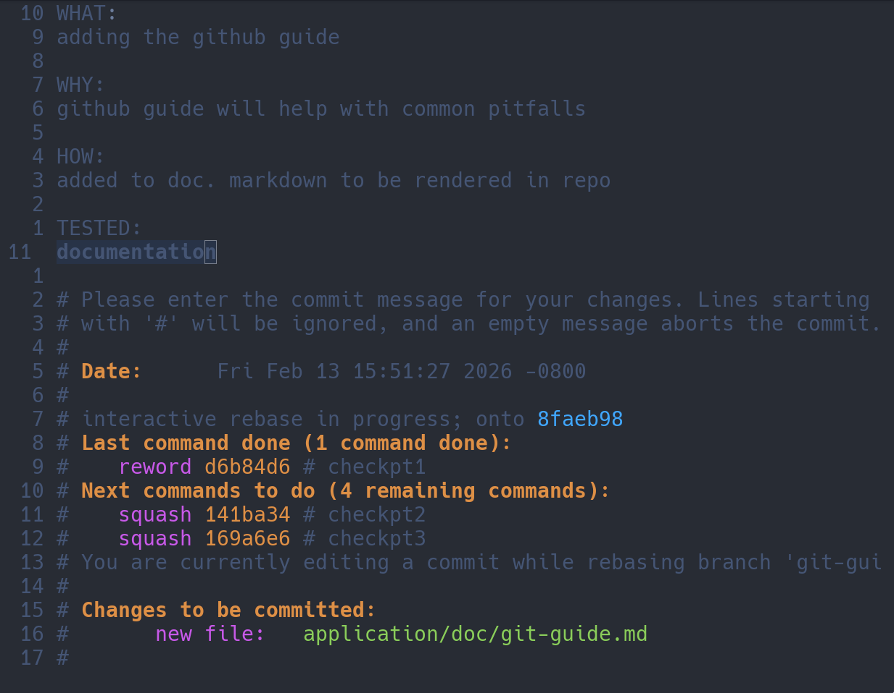
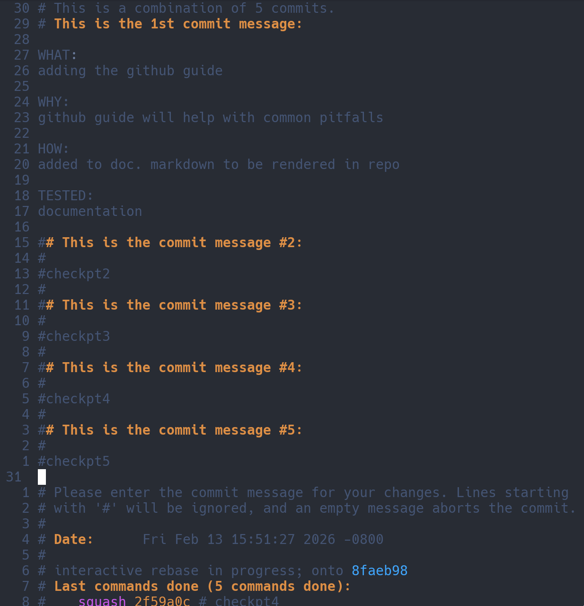
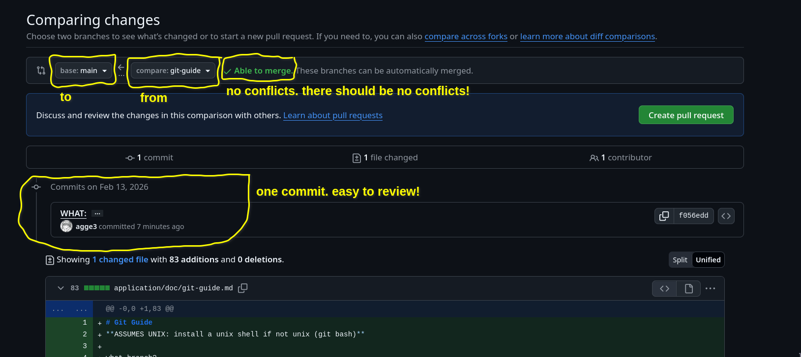
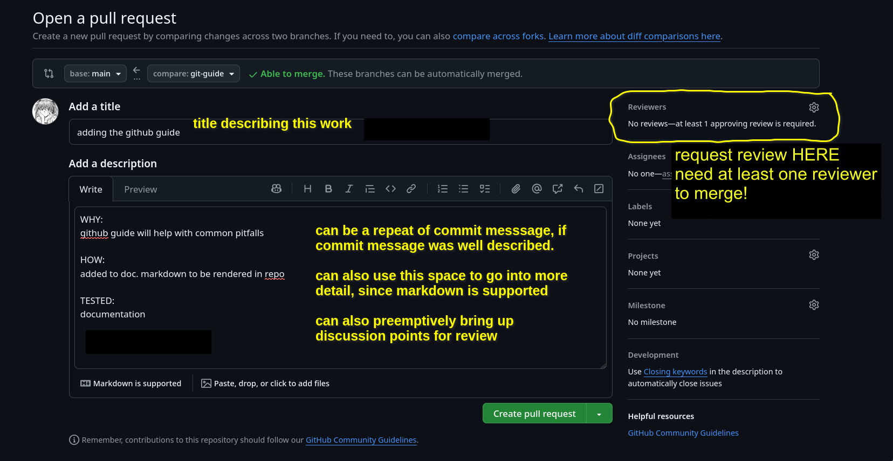
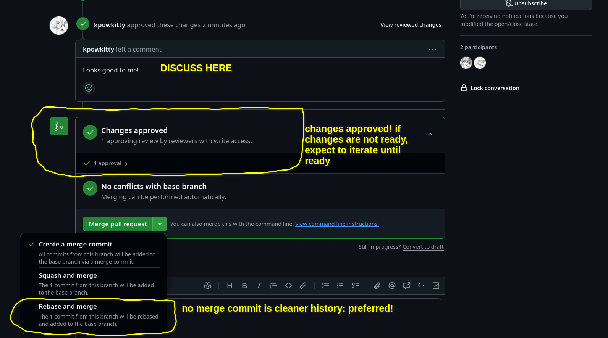

# Git Guide
**ASSUMES UNIX: install a unix shell if not unix (git bash)**

what branch?
```console
$ git branch | cat
  main
* setup
```

feature branch that forks off of CURRENT branch. so if you want to fork off
main, checkout main first (main's commit history). if you want to fork off of
some other branch and continue a commit history that may be confined to 1-2
people, then choose that branch. for the example, we'll get up-to-date main and
start building a new feature
```console
fetch all branches
$ git fetch --all

checkout main
$ git checkout main

pull REMOTE changes to LOCAL (or else, local filesystem will not be same as
remote). COMMON ISSUE
$ git pull origin main

$ git branch | cat
* main
  setup

fork from this current branch and create a new branch
$ git checkout -b <FEATURE_BRANCH>
Switched to a new branch 'git-guide'

confirm:
$ git branch | cat
* git-guide
  main
  setup

start working
```

commit INCREMENTALLY. can roll back easier
usually just:
```bash
git add --all

# but can specify specific files too:
git add ${SPECIFIC_FILE}

git commit -m "${MY_MSG}"
# according to github.com: "Commit messages should be short and descriptive of
# your change. If you are looking through your repository's history, you'll be
# guided by the commit messages, so they should tell a story."
```

flattening pull requests:
commits should be done often and incremental. however, this often leaves a messy
pr with a bunch of commits that may have been later revised or are too broken up
to capture the entirety of the work.
these should be flattened, so that reviewers can review the work in one commit
and also so that the work can be traced to one commit
when ready for a pull request...

```console
git rebase -i HEAD~<how_many_commits_ive_done_on_this_branch>
```

ex.
```console
git rebase -i HEAD~4

will open $EDITOR...
pick d6b84d6 # checkpt1
pick 141ba34 # checkpt2
pick 169a6e6 # checkpt3
pick 2f59a0c # checkpt4
pick 4bc560c # checkpt5

squash to the top commit (or where you want to squash and usually reword with a
better commit message, unless the top one is OK)
r d6b84d6 # checkpt1
s 141ba34 # checkpt2
s 169a6e6 # checkpt3
s 2f59a0c # checkpt4
s 4bc560c # checkpt5
```

reword commit message:


good commit message:


rebase will try to grab the other commit messages. our reworded commit message
should capture everything, and we want one commit to summarize our work. just
comment everything out:


finally force-push to overwrite the current branch with the new commit history.
PAY ATTENTION this is the correct branch. DESTRUCTIVE
```console
$ git push -f origin <MY_BRANCH>
```

now make pr:


click create pull request

example pr:


after review. MERGE you PR if reviewer hasn't already.


**WAITING ON A PR REVIEW DOES NOT MEAN WAITING FOR MORE WORK TO DO:** either
create another feature branch from main OR feature branch off this current
branch and keep your next pr separated for when the last is approved. if you're
deviating A LOT, please ask for a discussion or team meeting.

# git problems:
## destructive, complete reset:
```bash
# copy work into a tmp/backup directory

git reset --hard origin/<BRANCH>
git clean -xdf
# repo state is reset EXACTLY as remote

# piecemeal copy work back in and try again
```

## bad commit
```bash
git reset --soft HEAD~1
cd ${REPO_ROOT}

# removes ALL tracked files, can also replace `.` (which recursive `-r` for root
# `.`) with specific files you were working on
git rm --cached -r .

# adds ALL tracked files again, can also replace with specific files
git add -A

# try to commit again
```

## rebase problems
```bash
git rebase --abort
# try again
# if you're rebasing through multiple trees, you might have to keep applying the
# the same changes until it's sorted out
```
**NO REBASE MARKERS (`<<<<<<...`) IN THE REPO!**

## main got updated
```bash
# what branch am i on?
git branch | cat
* git-guide2
  main

# update main (or branch to get updates from)
git fetch --all # fetch all remotes
git pull origin main    # pull remote main into local main

# rebase updates into current branch (notice current branch is "git-guide2"
# above)
git rebase origin/main

# handle merge conflicts

# `-f` to overwrite remote branch with rebased branch
git push origin git-guide2 -f
```
